### Strapi - A Headless CMS for Modern Development

Strapi is an open-source Node.js headless CMS fully customizable and developer-first.

- Basic Use:

    - Headless Architecture:
    Strapi adopts a headless architecture, decoupling the backend and frontend. This allows developers to design and structure the content independently of the presentation layer, offering flexibility and versatility.
    Traditional use cases include static websites, mobile apps, e-commerce, editorial and corporate websites. However, you can use Strapi to build any type of content-oriented applications including delivery to portable IoT devices or internal tools.

    - API-First Approach:
    Strapi follows an API-first approach, making it easy to create, manage, and consume APIs. Developers can define their data models and content types, and Strapi automatically generates RESTful or GraphQL APIs, making it seamless to integrate content into any application.

    - Content Modeling:
    Strapi provides a user-friendly interface to model and define content structures. Developers can create custom fields, relationships, and validations, tailoring the CMS to meet specific project requirements.

- Key Features:

    - User-Friendly Admin Dashboard:
    Strapi comes with a customizable admin panel that makes it easy for non-technical users to manage content. The intuitive interface allows content editors to create, update, and delete content without the need for developer intervention.

    - Authentication and Authorization:
    Strapi includes robust user authentication and role-based access control. Developers can easily define user roles and permissions, ensuring that sensitive content and functionalities are secure.

    - Plugin System:
    The extensibility of Strapi is amplified through its plugin system. Developers can enhance functionality by installing pre-built plugins or creating custom ones, tailoring the CMS to the specific needs of the project.

    - Database Agnostic:
    Strapi supports a variety of databases, including MongoDB, MySQL, PostgreSQL, and SQLite. This flexibility allows developers to choose the database that best suits their application's requirements.

    - Role-Based Access Control (RBAC):
    Strapi includes a robust RBAC system that allows administrators to define roles and permissions for users. This ensures secure access control and helps manage user privileges.

    - Dynamic Zone and Components:
    Strapi introduces the concept of "Dynamic Zones" and "Components" that provide a flexible way to handle dynamic and reusable content structures. This allows for the creation of modular and complex content models.

    - Content Internationalization (i18n):
    Strapi supports content internationalization, making it easier to manage and present content in multiple languages. This is particularly useful for projects with a global audience.

    - Webhooks and Triggers:
    Strapi provides support for webhooks and triggers, enabling developers to automate workflows and integrate with external services seamlessly.

#### Strapi Dashboard

The Strapi Dashboard is a web-based visual interface that provides a user-friendly environment for managing various aspects of your Strapi project.

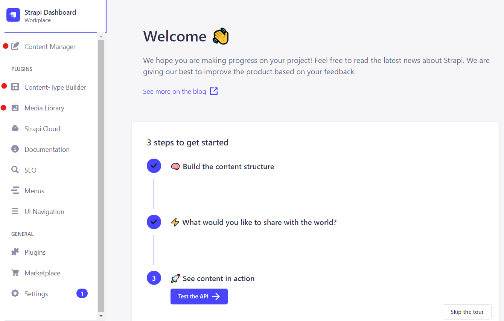

Main Feature:

- Content Type Builder
    - Define content types and their attributes.
    - Create relationships between content types.
    - Add custom fields, validations, and settings.

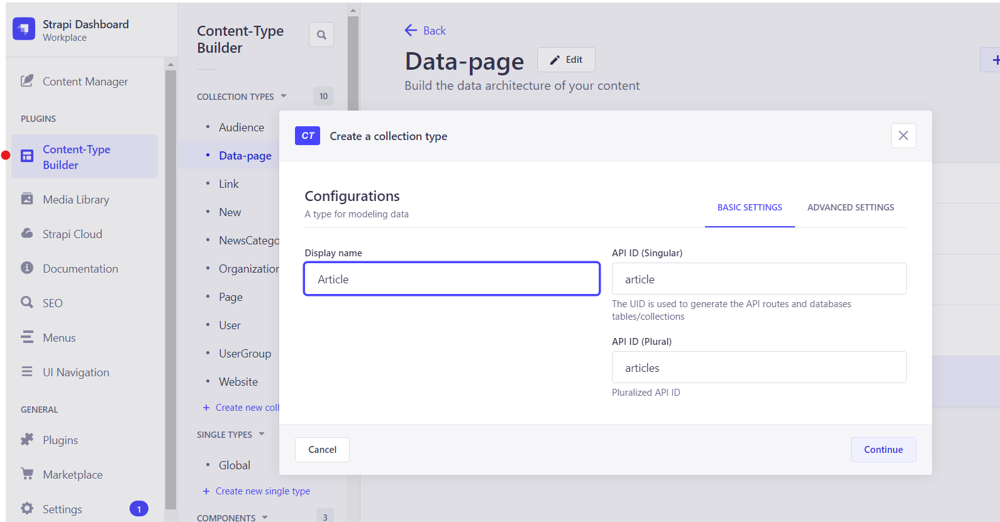
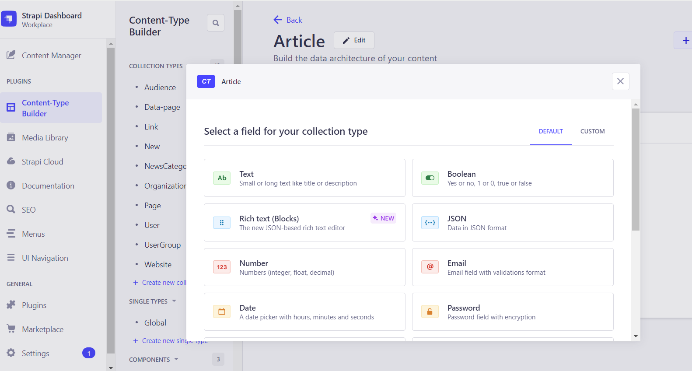
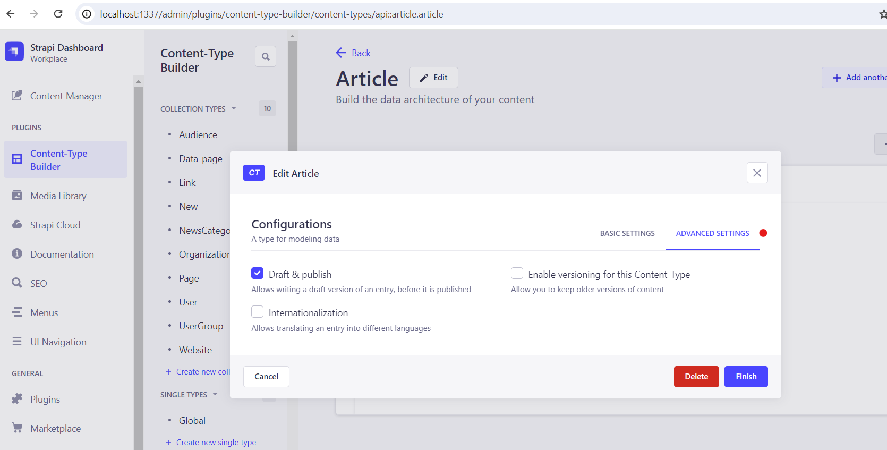

- Content Manager
    - Create, edit, and delete content entries.
    - Manage relationships between different content types.
        - Collection types are content-types that can manage several entries.
        - Single types are content-types that can only manage one entry.
        - Components are a data structure that can be used in multiple collection types and single types.
        
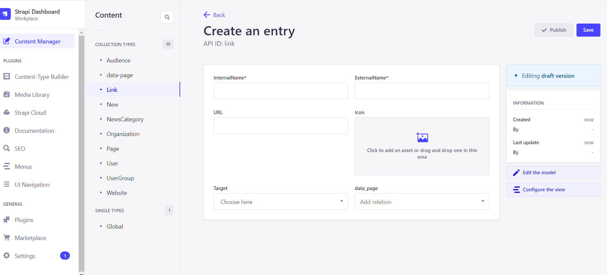

- Media Library
    - Upload and organize media files.
    - View and manage metadata for media assets.
    - Utilize media assets in content entries.

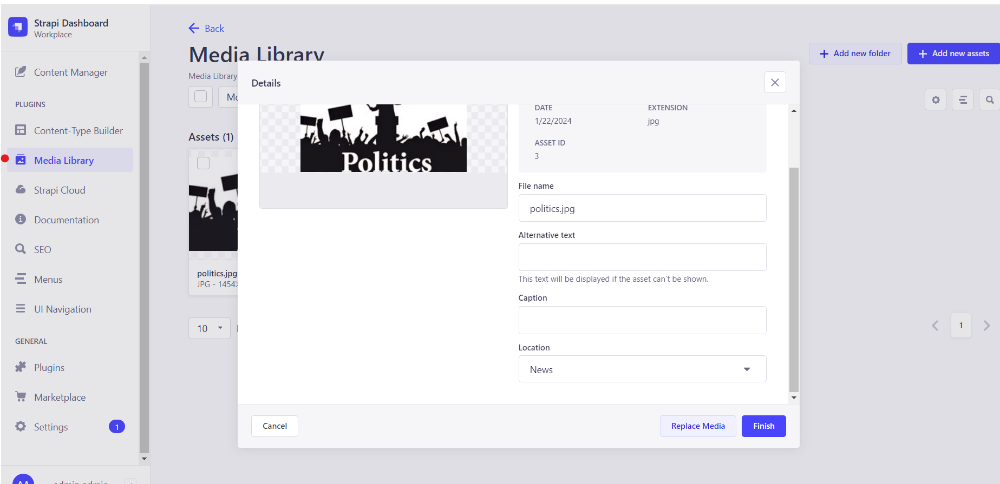

- Internationalization
    - Define and manage translations for content entries.
    - Enable support for multiple languages.
    - Customize and organize translations in the Content Manager.

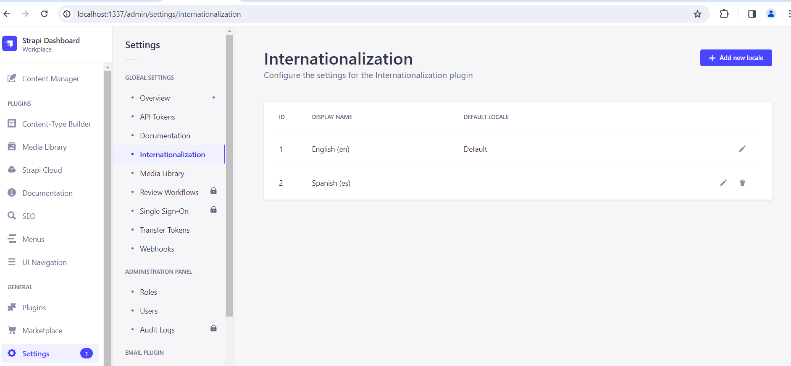
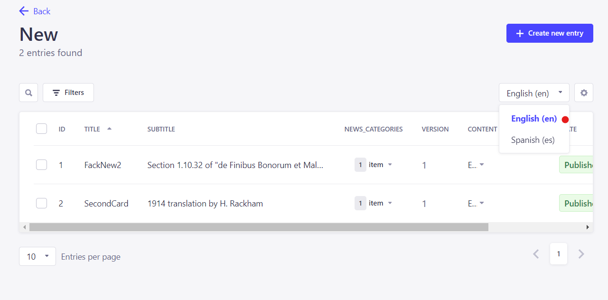
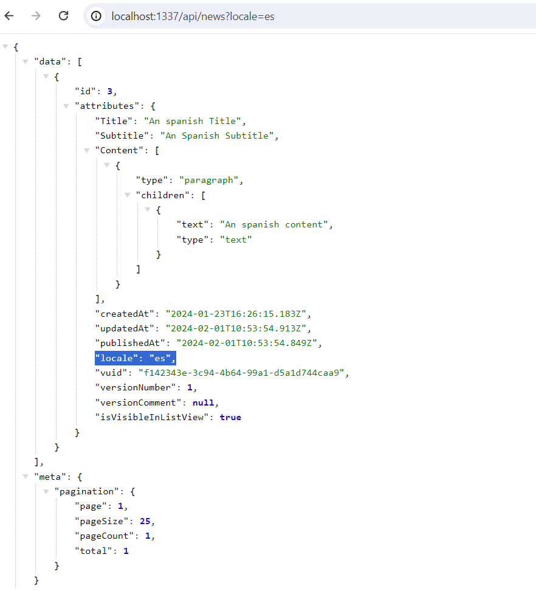

- Role and Permissions
    - Create and manage user roles with specific permissions.
    - Control access to content types, APIs, and settings.
    - Implement Role-Based Access Control (RBAC) for users.

[Documentation](https://docs.strapi.io/user-docs/users-roles-permissions)

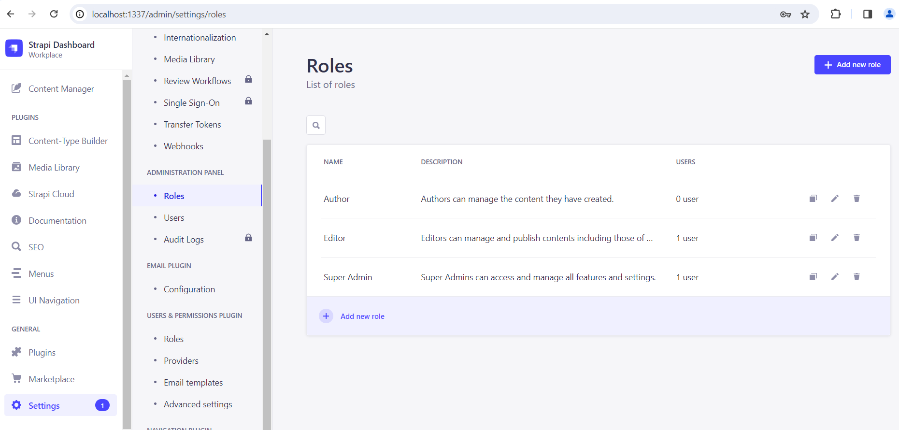
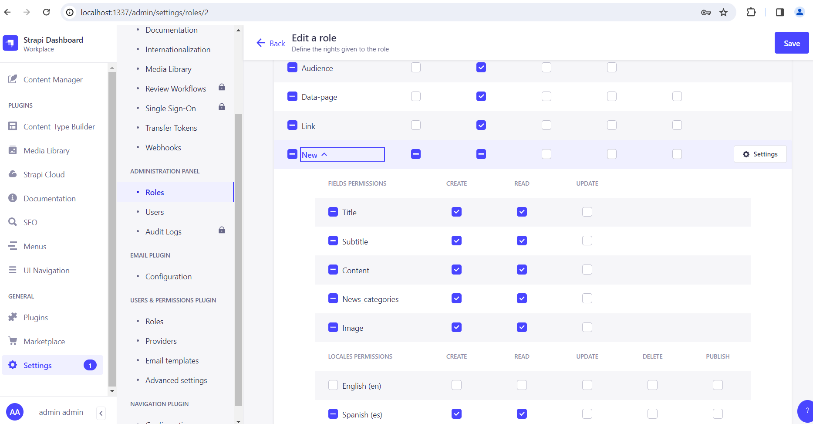
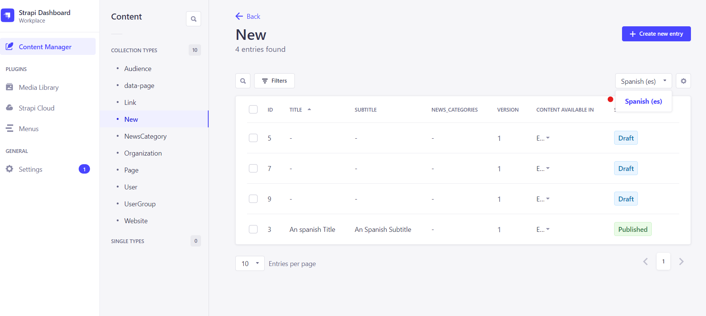
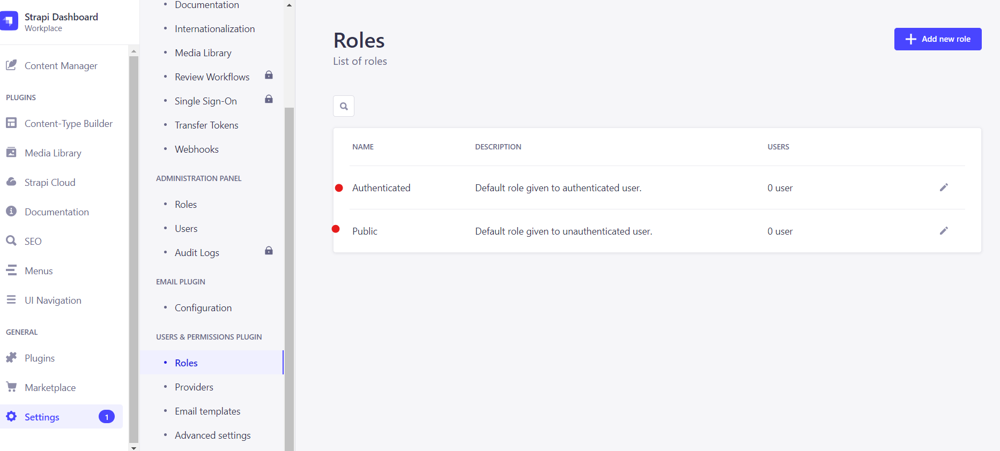

#### Strapi Pro:

- Open source: Available in GitHub and supported by hundreds of contributors.
- Self-hosted: Gives you full control of your data and privacy.
- Customizable: Via admin panel or directly extending with plugins and customizations.
- Flexible: Consume it from any client, SPA, or mobile app, as well as via REST or GraphQL.

#### Strapi Limitations:

- All-in-One Solution:
  Strapi is **NOT** an all-in-one. Strapi is **NOT** a full-fledged content management system that includes both a backend for content management and a frontend for website presentation. It does **NOT** include a built-in frontend for presentation.

- Multi-sites:
  Unfortunately, handling multiple sites within a single Strapi instance is not supported in Strapi-V4 as of 02/2024. There is no built-in multi-tenancy plugin available in the latest version.
  [For further details, refer to the Official Documentation-Item-6](https://strapi.io/blog/strapi-support-most-frequently-asked-questions-on-the-website)
  While there are some workarounds accessible, such as utilizing the strapi-plugin-multi-tenant or creating different instances based on a single code-source, it's important to note that these workarounds might not provide a straightforward and maintainable solution. If your business requirements necessitate the management of multiple sites, it's advisable to consider alternative CMS options better suited to handle this specific use case, as Strapi may not be the optimal choice in such scenarios.

- Learning Curve:
  Strapi, as a developer-first CMS, with its extensive features and flexibility, might have a steeper learning curve for newcomers or those not familiar with headless CMS concepts. It's important to allocate time for the learning process, especially for **non-developers**.

- Plugin Usage and Compatibility:
  Strapi has a growing community and there are bunch of non-offiacial free plugin. However, Strapi doesn't garanty that those plugin work as expected. It is also important to consider that, as the platform evolves, plugin compatibility might be affected.

- Content Preview:
  Compared to some traditional CMS solutions, Strapi might have limitations in providing a built-in content preview functionality. Previewing content changes before publishing may require additional custom development.

- Built-in Search:
  Strapi does not provide a built-in search feature out of the box. You may need to integrate third-party search solutions or develop a custom search feature.

- Real-time Collaboration:
  Strapi may not be the best choice for projects that require real-time collaboration on content editing. While it supports collaborative content management, some traditional CMS platforms may have more advanced real-time collaboration features
